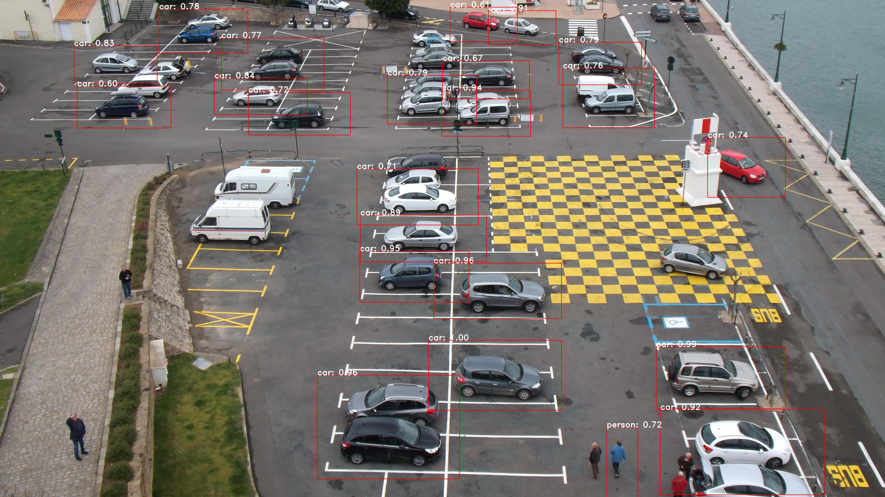
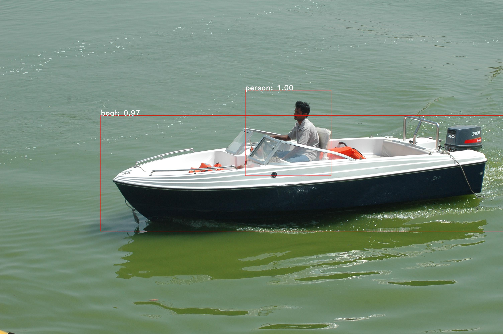
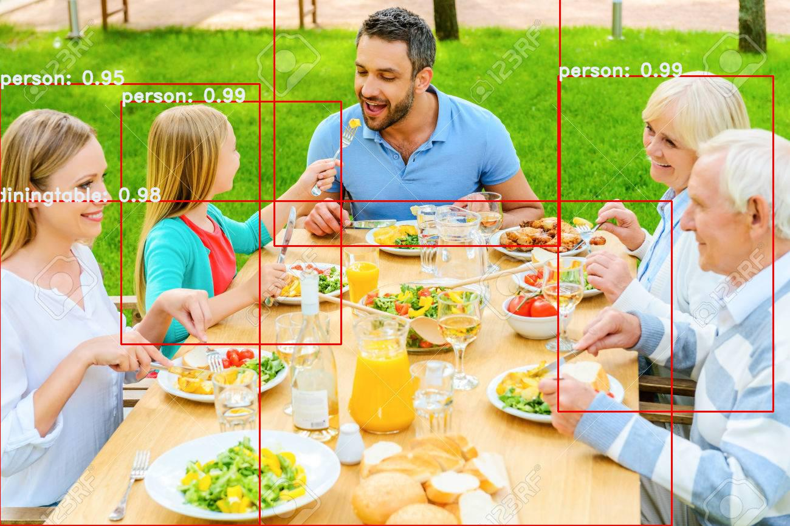

# SSD-Object-Detection

In this project, I have used SSD512 algorithm to detect objects in images and videos.<br/>
This project use prebuild model and weights.
<h4> For Original Model creation and training on your own datasets, please check out <a href='https://github.com/pierluigiferrari/ssd_keras'> Pierluigi Ferrari' SSD Implementation</a> 

## Overview
SSD (Single Shot MultiBox Detector) <br/>
* Single Shot: this means that the tasks of object localization and classification are done in a single forward pass of the network
* MultiBox: this is the name of a technique for bounding box regression developed by Szegedy et al.
* Detector: The network is an object detector that also classifies those detected objects

<h2> Examples </h2>
<p> 
  <br/>
  <br/>
  
</p>

## Dependencies
* Python 3+
* Keras (with tensorflow backend)
* OpenCV
* Numpy
* imageio
* ffmpeg

## How to use 
1. Fork this repo 
2. Download the pretrained weights by the following link and save it in weights folder.  <a href='https://drive.google.com/file/d/1a-64b6y6xsQr5puUsHX_wxI1orQDercM/view'>```Weigths```</a>
3. Put the test images under ```inputs/images``` and videos under ```inputs/videos```
4. Execute the ```SSD-Object-Detection.py``` file.
5. Voilà, check the ```outputs``` folder.

## References
* Original Keras implementation of SSD by <a href='https://github.com/pierluigiferrari/ssd_keras'> Pierluigi Ferrari </a> 
* Orginal Paper <a href='https://www.cs.unc.edu/~wliu/papers/ssd.pdf'> SSD: Single Shot MultiBox Detector <a>
